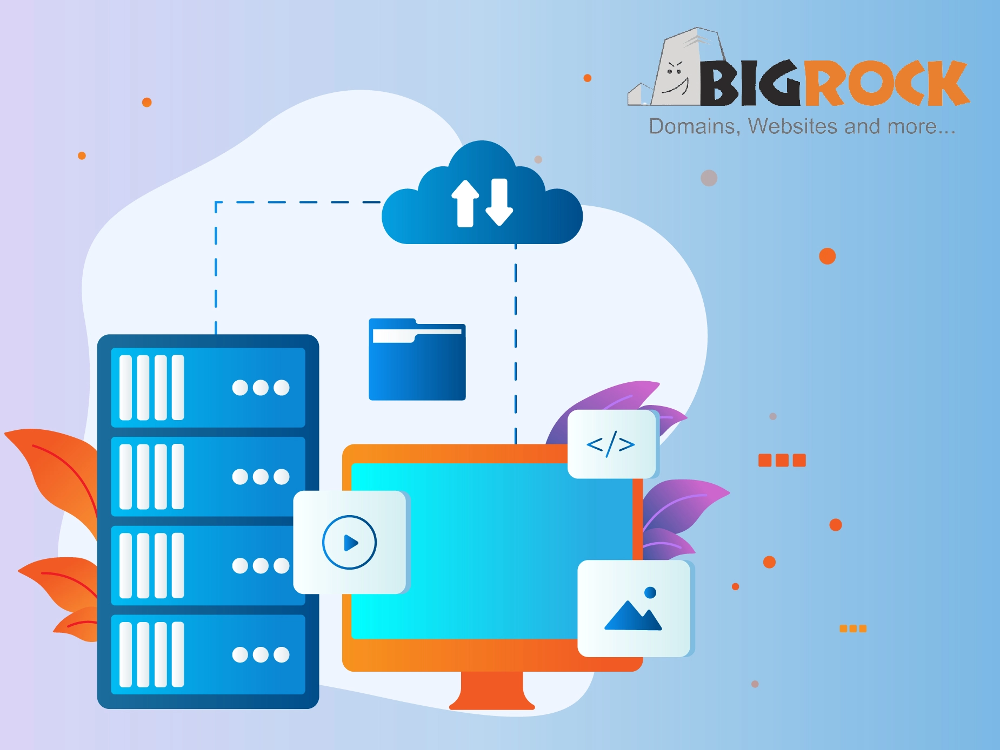

# Best Cloud Hosting in India: 9 Top-Rated Providers for 2025

Looking to keep your website online 24/7 without the worry of sudden server crashes? Smart move. When your site lives on a single server, one hiccup can mean serious downtime. But there's a better way.

The best cloud hosting providers in India spread your content across multiple servers—so if one goes down, the others keep running. You get better uptime, faster speeds, and local data centers that actually understand Indian network infrastructure. Below, we've tested and ranked 9 platforms that deliver dedicated resources, easy management panels, and pricing that won't drain your budget.

---

Think of cloud hosting as a connected network of servers working together. Unlike traditional server hosting where everything sits in one place, cloud hosting distributes your website data across multiple machines. One server fails? Another instantly takes over. Your site stays up, your visitors stay happy.

## Why Indian Businesses Need Cloud Hosting Now

Here's the thing about server locations: they matter more than you'd think. When your hosting provider has data centers in Mumbai, Bangalore, or Delhi, Indian visitors see faster load times. Plus, you're dealing with local support teams who actually understand GST compliance and regional network quirks.

The providers below offer exactly that—solid infrastructure both locally and globally, with straightforward control panels that don't require a computer science degree to navigate.

## 1. BigRock – Best Overall Cloud Hosting India

BigRock gets the basics right for Indian businesses and developers. Their cloud plans come with hourly billing, so you only pay for what you actually use. Good for projects where resource needs bounce around.

Security-wise, they've got you covered with built-in DDoS protection, dedicated IPs, and automatic daily backups. The NVMe SSD storage means your data lives on multiple servers, minimizing loss risks. Their cPanel integration makes managing email accounts and domains pretty painless.

**Key Features:**
- 99.99% uptime with Varnish caching for faster load times
- Scale CPU and RAM without server restarts
- One-click installs for WordPress, Joomla, Drupal
- High-performance hardware reduces page load lag

**Pricing:**
- **Starter SSD (₹479/month):** 1 website, 25GB SSD, unlimited bandwidth, 2GB RAM, 2vCore CPU
- **Advanced SSD (₹599/month):** 50 websites, 50GB storage, 4GB RAM, 4vCore CPU
- **Business SSD (₹839/month):** 100 websites, 100GB SSD, 6GB RAM, 6vCore CPU

## 2. DigitalOcean – Developer-Friendly Cloud Server

Developers love DigitalOcean for good reason. The platform strips away unnecessary complexity while giving you serious control when you need it. Their Droplets (virtual machines) let you spin up new servers in seconds.

What makes them stand out? Kubernetes support that actually works smoothly, GPU Droplets for AI projects (powered by NVIDIA H100 processors), and managed databases that auto-scale. The load balancers distribute traffic intelligently across multiple servers, keeping things fast even during traffic spikes.

**Key Features:**
- Droplets deploy in under 60 seconds with custom resource allocation
- Kubernetes for container management without the headache
- Managed MySQL, PostgreSQL, MongoDB databases with auto-backups
- Block and object storage options for different data types
- Developer-focused documentation and API

If you're building something more technical than a basic WordPress site, especially anything involving AI or machine learning, this is worth checking out. 👉 [Want reliable cloud infrastructure that scales with your development needs?](https://www.vultr.com/?ref=9738262-9J) Compare performance benchmarks before committing.

## 3. Hostinger – Budget-Friendly Cloud Server

Hostinger makes cloud hosting affordable without cutting corners. Their AI-powered platform includes a drag-and-drop website builder, SEO tools, and heat mapping—stuff that usually costs extra elsewhere.

The 99.9% uptime guarantee comes with data centers in India, so your local visitors get fast load times. NVMe storage, HTTP/3 protocol, and dedicated IPs push speeds up to 4x faster than standard hosting. Free SSL certificates and unlimited bandwidth are included in every plan.

**Key Features:**
- AI website builder with one-click WordPress install
- Daily automatic backups with one-click restore
- 24/7 LiveChat support in your timezone
- Scale resources (RAM, CPU, storage) with a single click
- Free SSL certificates and unlimited bandwidth

**What You Actually Get:**
The cloud plans start at ₹449/month and include everything you need to run a professional website without hiring a developer. The AI tools help with copywriting and SEO, which saves time if you're managing content yourself.

## 4. ScalaHosting – Best for Beginners

ScalaHosting built their own control panel (SPanel) to replace cPanel, and honestly? It's easier to use. You get full server control without the technical overwhelm.

Their cloud hosting comes with 99.95% uptime and automatic failover—if hardware fails, your site instantly moves to a working server. The 10Gbps network handles traffic smoothly, and you can choose data center locations across the US and Europe (with AWS partnerships adding more options).

**Key Features:**
- SPanel: Free, intuitive control panel alternative to cPanel
- Server setup completes in 30 seconds after ordering
- Upgrade resources (CPU, RAM, storage) with one click
- Supports Apache, Nginx, MariaDB, PHP servers
- Multiple data center locations reduce latency

**Why Beginners Like It:**
Everything's clearly labeled, tasks don't require command-line knowledge, and the managed services handle technical maintenance. You focus on content; they handle server stuff.

## 5. InMotionHosting – Feature-Packed at Low Prices

InMotion delivers 99.90% uptime with automatic failover and hardware redundancy. Translation: your site stays online even when individual components fail.

They include free DDoS protection, which blocks malicious traffic that could crash your server. The cPanel management tools and one-click installers make setup straightforward, while full root access gives developers the customization options they need. Auto-backups run regularly, so data recovery is simple if something goes wrong.

**Key Features:**
- 100% cloud availability with automatic hardware failover
- Scale resources instantly based on traffic demands
- Free DDoS protection shields against attacks
- Full root access for advanced server configuration
- Premium hardware ensures fast load times
- Automatic daily backups with easy restoration

For websites expecting traffic spikes—like during sales or launches—the ability to quickly scale resources prevents slowdowns. This kind of flexibility typically costs more elsewhere.

## 6. HostGator – Most User-Friendly Cloud Server

HostGator combines cloud power with shared hosting simplicity. Their SSD NVMe storage delivers faster read/write speeds than traditional drives, which means quicker page loads for visitors.

Built-in caching optimizes server speed automatically. The managed services handle server setup, patching, and maintenance, letting you focus on business rather than technical details. Free SSL certificates boost security and SEO rankings. Support runs 24/7 if you hit snags.

**Key Features:**
- NVMe SSD storage for faster performance
- One-click resource upgrades (CPU, RAM, storage)
- Pre-configured caching reduces load times
- Fully managed server maintenance and updates
- Free SSL certificate with every plan
- cPanel for easy domain, email, and file management
- 24/7 award-winning support via live chat

**Pricing:**
Plans scale from basic startups to high-traffic sites, with straightforward upgrade paths as your needs grow. The managed approach means less time troubleshooting, more time building your business.

## 7. Kamatera – Scalable with Limitless Customization

Kamatera's been doing cloud infrastructure for over 20 years. Their platform offers serious flexibility—customize CPU, RAM, and storage exactly how you need them, then adjust on the fly.

With 23 data centers globally (including in India), you can deploy close to your users for lower latency. They offer both monthly billing and pay-as-you-go hourly rates, so you're not locked into fixed costs when traffic fluctuates. The 30-day free trial lets you test everything before committing money.

**Key Features:**
- Scale CPU, RAM, storage up or down anytime
- Simple management console plus powerful API
- 23 global data centers minimize latency
- Monthly or hourly pay-as-you-go billing
- 24/7 support via phone, chat, email
- Cloud firewalls, private networks, data encryption
- 100+ OS options including custom ISO support

**When It Makes Sense:**
If your resource needs vary significantly—seasonal businesses, development testing, growing startups—the flexible billing saves money. Pay for what you use, nothing extra.

## 8. Vultr – High-Performance Cloud Globally

Vultr specializes in performance. Their High Frequency Cloud Computing uses faster processors for applications needing quick response times. The Cloud GPU servers handle AI and machine learning workloads with dedicated NVIDIA resources.

Over 32 data centers worldwide mean you can position servers close to users anywhere. They support multiple operating systems including CentOS, Debian, Ubuntu, Windows, and FreeBSD. Custom ISO images work too, so you can deploy exactly what you need. Hourly billing charges only for active resource usage.

**Key Features:**
- High Frequency servers deliver maximum processing speed
- Optimized Cloud Compute with dedicated high-performance CPUs
- Bare Metal servers offer single-tenant resources
- Cloud GPU combines computing power with AI capabilities
- 32+ global data centers (including India)
- Automated backups and snapshot scheduling
- Flexible networking with dedicated IPs and DDoS protection

When raw computing power matters—gaming servers, video processing, complex applications—Vultr's infrastructure handles demanding workloads smoothly. Speaking of high-performance global infrastructure, 👉 [explore enterprise-grade cloud solutions built for speed and reliability](https://www.vultr.com/?ref=9738262-9J) if you're scaling beyond basic hosting needs.

## 9. HostArmada – Low-Price Option for Beginners

HostArmada focuses on speed, security, and reliability without premium pricing. Their cloud-based infrastructure uses AI-powered security that adapts to different attack types, keeping sites protected.

They promise 99.9% uptime with 24/7/365 infrastructure monitoring. Fast load times help with SEO rankings since Google considers speed a ranking factor. The cPanel interface simplifies site management for beginners, and 24/7 support responds quickly when problems arise.

**Key Features:**
- Fast loading speeds improve SEO rankings
- 99.9% uptime guarantee with constant monitoring
- AI-based security adapts to threats
- 24/7 certified expert support
- Flexible pricing plans for different budgets
- User-friendly cPanel control panel

**Best For:**
Startups and small businesses wanting solid performance without complex features or high costs. You get essentials done right at prices that make sense.

---

## Making Your Choice

The right cloud hosting provider depends on what you're building. Developers needing serious customization lean toward DigitalOcean or Kamatera. Beginners wanting simplicity prefer ScalaHosting or HostArmada. Businesses prioritizing support and managed services choose InMotion or HostGator.

Consider these factors: how easily can you scale? What's the actual uptime track record? How responsive is support? Does pricing match your budget and usage patterns? Are there Indian data centers for faster local access?

Cloud technology gives businesses flexibility that traditional hosting can't match. When your website needs more resources, you add them instantly. When traffic drops, you scale back and save money. Your site stays online even during hardware failures. That reliability alone justifies the switch for most growing businesses.

The providers above all deliver solid cloud infrastructure—pick based on your technical comfort level, budget, and specific feature needs. Your website's performance and availability improve significantly when hosted on proper cloud infrastructure rather than shared or single-server setups.
